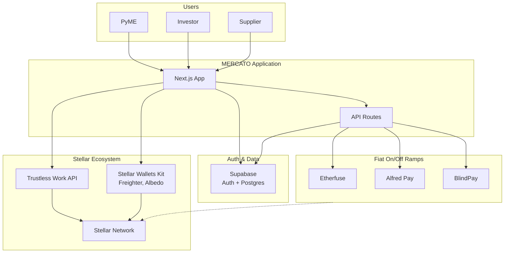
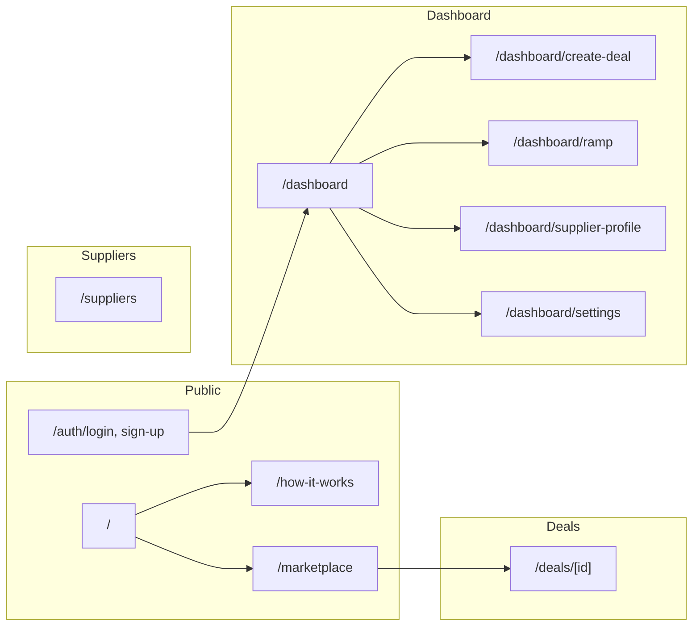
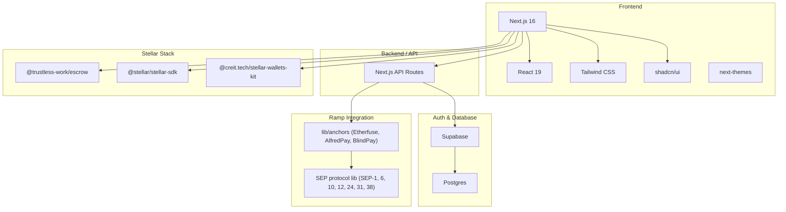
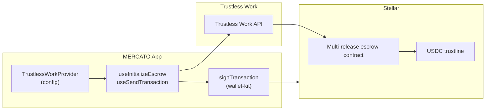
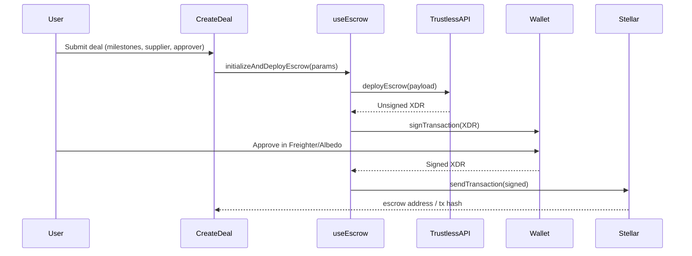
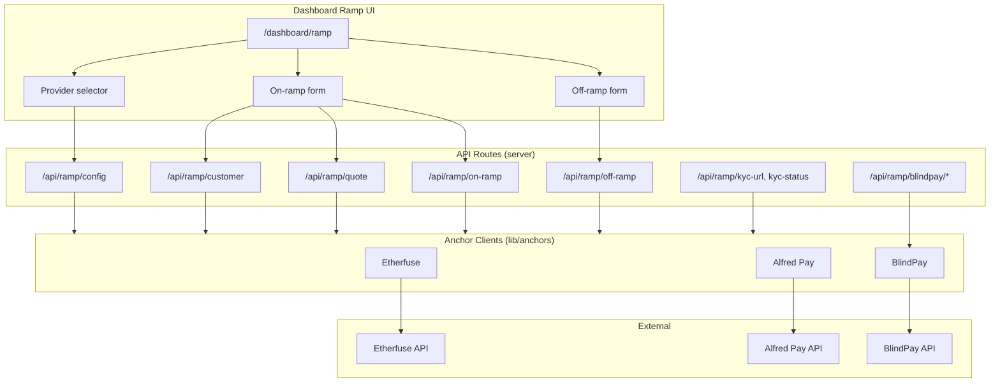
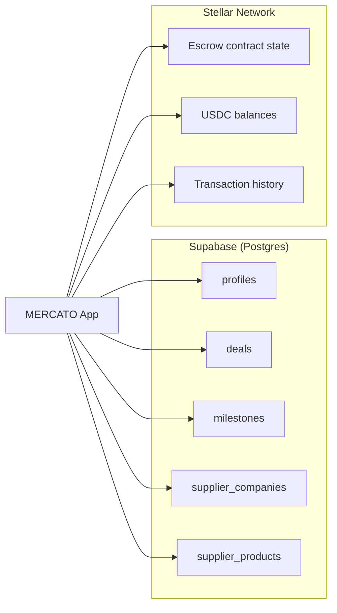
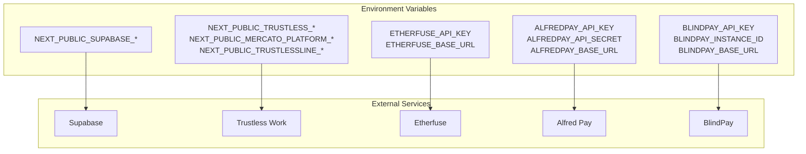
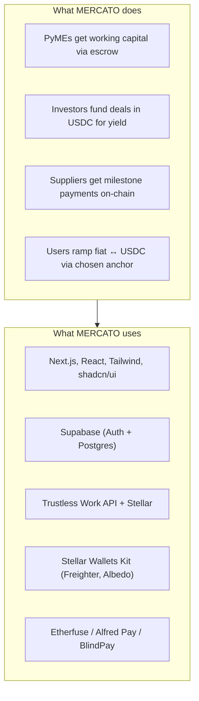

# MERCATO — Architecture Documentation

**Supply chain finance, transparently secured.**

This document describes the MERCATO application architecture: what it does, which tools and Stellar-based projects it uses, and how ramp providers integrate. Diagrams use [Mermaid](https://mermaid.js.org/) and render in GitHub, GitLab, and most Markdown viewers.

---

## 1. High-Level System Overview



**Summary:** MERCATO is a web app that connects **PyMEs**, **investors**, and **suppliers** through blockchain-secured escrow. Auth and deal data live in **Supabase**; escrow and payments are **non-custodial** on **Stellar** via **Trustless Work**. Users can move fiat to/from Stellar assets via configurable **ramp** providers (Etherfuse, AlfredPay, BlindPay).

---

## 2. What the Application Does

### 2.1 Core Flows

```mermaid
sequenceDiagram
  participant PyME
  participant App
  participant Trustless
  participant Stellar
  participant Investor
  participant Supplier

  Note over PyME,Supplier: 1. PyME creates deal & deploys escrow
  PyME->>App: Create deal (basics, supplier, milestones)
  App->>Trustless: Initialize multi-release escrow
  Trustless->>Stellar: Deploy escrow contract
  PyME->>Stellar: Sign with wallet (Freighter/Albedo)
  Stellar-->>App: Escrow address

  Note over PyME,Supplier: 2. Investors fund the deal
  Investor->>App: Browse marketplace, select deal
  Investor->>Stellar: Fund escrow in USDC (wallet)

  Note over PyME,Supplier: 3. Supplier delivers; milestones released
  Supplier->>App: Submit delivery proof
  PyME->>App: Approve milestone
  App->>Trustless: Request release
  Trustless->>Stellar: Release payment to supplier

  Note over PyME,Supplier: 4. PyME repays investors
  PyME->>Stellar: Repay principal + yield (after term)
```

### 2.2 User Roles and Capabilities

| Role      | Main actions |
|----------|--------------|
| **PyME** | Create deal, configure milestones, approve releases, repay investors; connect Stellar wallet for escrow deployment. |
| **Investor** | Browse marketplace, fund deals in USDC; funds locked in escrow until milestones. |
| **Supplier** | Profile in directory, submit delivery proof; receive milestone payments to Stellar address. |

### 2.3 Application Structure (Routes)



---

## 3. Tools and Tech Stack



| Layer        | Technology |
|-------------|------------|
| **Frontend** | Next.js 16, React 19, Tailwind CSS, shadcn/ui, next-themes (light/dark) |
| **Auth & DB** | Supabase (Auth, Postgres) |
| **Escrow** | Trustless Work API + Stellar (non-custodial) |
| **Wallets** | Stellar Wallets Kit (Freighter, Albedo) |
| **Ramps** | Custom anchor clients (Etherfuse, AlfredPay, BlindPay) + optional SEP modules |

---

## 4. Stellar and Trustless Work (Trustless Escrow)

Escrow is **non-custodial**: funds sit in a Stellar contract; the platform does not hold them. **Trustless Work** provides the API and contract logic; the PyME signs deployment with their Stellar wallet.

### 4.1 Trustless Work in the Stack



### 4.2 Escrow Configuration (from app)

- **Platform address** (`NEXT_PUBLIC_MERCATO_PLATFORM_ADDRESS`): Used as `releaseSigner`, `disputeResolver`, and `platformAddress` in escrow roles.
- **USDC trustline** (`NEXT_PUBLIC_TRUSTLESSLINE_ADDRESS`): Stellar asset (trustline contract) used for escrow payments.
- **Network**: `testnet` or `mainnet` via `NEXT_PUBLIC_TRUSTLESS_NETWORK`.

### 4.3 Escrow Flow (Create Deal)



---

## 5. Ramp Providers (Fiat On/Off)

MERCATO supports **multiple ramp providers**. Users choose one in the UI; the app proxies all anchor calls through **API routes** so API keys stay server-side.

### 5.1 Ramp Providers Overview



### 5.2 Ramp Companies and Capabilities

| Provider    | Region / focus     | Fiat rail | Stellar asset | KYC flow   | Off-ramp signing |
|------------|--------------------|-----------|----------------|------------|-------------------|
| **Etherfuse** | Mexico             | SPEI      | USDC, CETES    | Iframe     | Deferred (poll for XDR, then sign) |
| **Alfred Pay** | Latin America      | SPEI      | USDC           | Form       | Standard          |
| **BlindPay**  | Global             | Multiple  | USDB           | Redirect   | Anchor payout submission |

Provider availability is driven by **environment variables**; `getConfiguredProviders()` returns only anchors with all required env vars set. Users see and select from this list on the ramp page.

### 5.3 Ramp Data Flow (On-ramp example)

```mermaid
sequenceDiagram
  participant User
  participant RampUI
  participant API
  participant Anchor
  participant External

  User->>RampUI: Enter amount, request quote
  RampUI->>API: POST /api/ramp/customer (if needed)
  API->>Anchor: createCustomer / getCustomer
  Anchor->>External: Anchor API
  External-->>API-->>RampUI: customer

  RampUI->>API: POST /api/ramp/quote
  API->>Anchor: getQuote(...)
  Anchor->>External: Quote API
  External-->>API-->>RampUI: quote

  User->>RampUI: Confirm, start on-ramp
  RampUI->>API: POST /api/ramp/on-ramp
  API->>Anchor: createOnRamp(...)
  Anchor->>External: Create order
  External-->>API-->>RampUI: payment instructions (e.g. CLABE)

  User->>External: Send fiat (e.g. SPEI)
  Note over User,External: Poll GET /api/ramp/on-ramp/[id] until completed
  External->>Stellar: Credit user wallet (e.g. USDC)
```

---

## 6. Data and Responsibility Split



- **Supabase**: Users, profiles, roles, deal metadata, milestones, supplier directory and products. Source of truth for “who created what” and milestone approval state.
- **Stellar**: Escrow deployment, USDC locking, milestone releases, repayments. Source of truth for funds and on-chain escrow state.

---

## 7. Environment and External Services



- **Supabase**: Auth and Postgres (profiles, deals, milestones, suppliers).
- **Trustless Work**: Escrow API and Stellar contract deployment/management.
- **Ramp providers**: One or more of Etherfuse, AlfredPay, BlindPay; only those with env vars set are exposed in `/api/ramp/config`.

---

## 8. Summary Diagram

Single-page overview of **what MERCATO uses** and **what it does**:



---

## References

- [Trustless Work](https://docs.trustlesswork.com/) — Escrow API and Stellar integration
- [Stellar](https://stellar.org) — Network and assets
- [Stellar Wallets Kit](https://stellarwalletskit.dev/) — Wallet connection (Freighter, Albedo)
- [Supabase](https://supabase.com) — Auth and database
- [lib/anchors/README.md](../lib/anchors/README.md) — Anchor interface and ramp provider details
